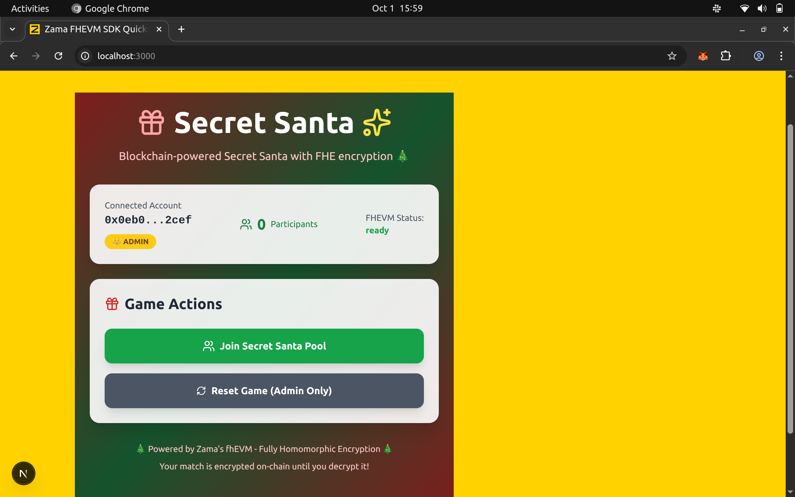
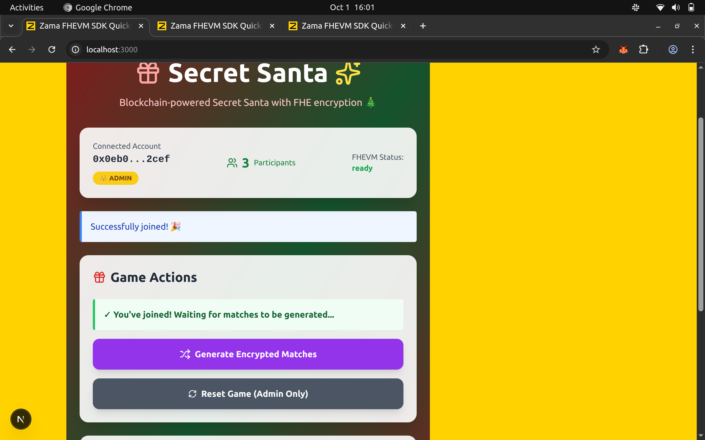
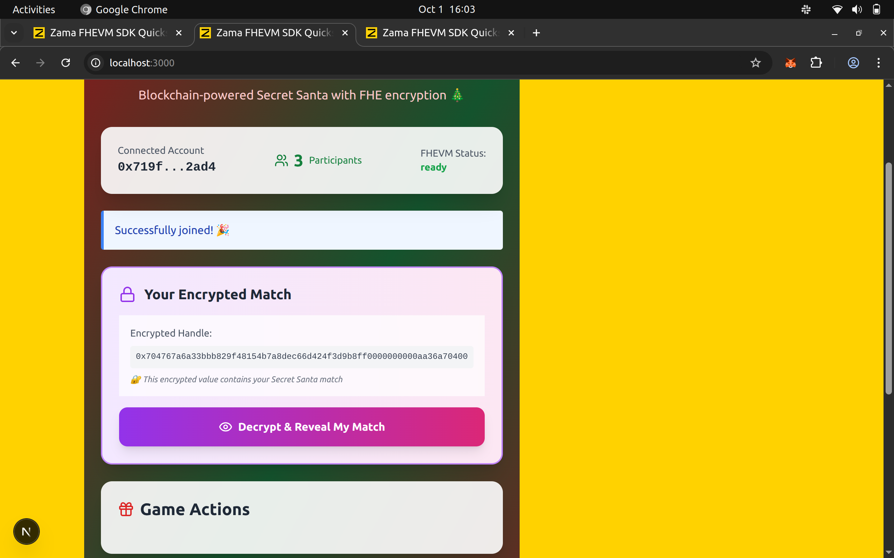
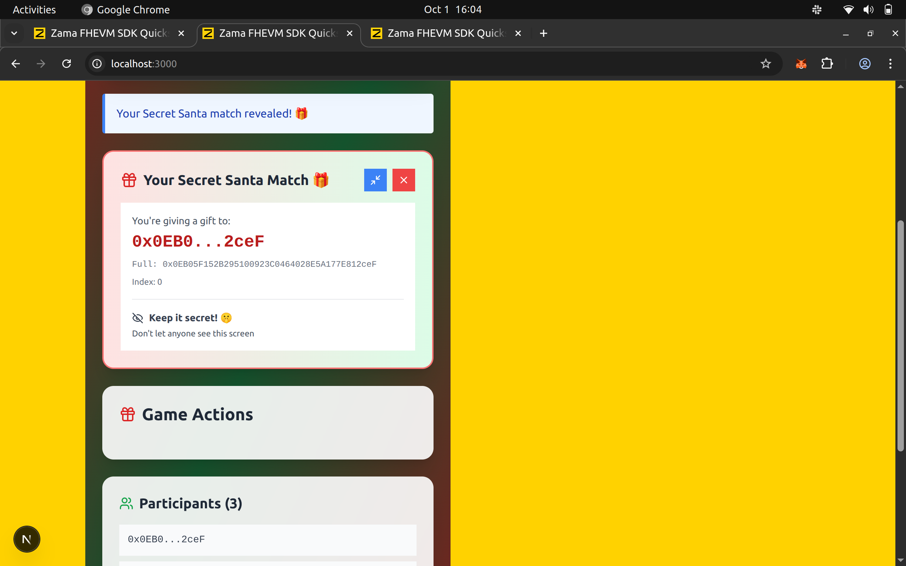

# Hello FHEVM: Build a Secret Santa dApp with Encrypted Matching

## 🎅 What We're Building

Imagine organizing a Secret Santa gift exchange where **nobody** (not even the organizer!) can see who's matched with whom until each person reveals their own match. This is the power of Fully Homomorphic Encryption (FHE) on the blockchain.

In this tutorial, you'll build a complete Secret Santa dApp where:

- Players join a pool anonymously
- Matches are generated **encrypted on-chain** (no one can peek!)
- Each player can decrypt ONLY their own match
- Everything is transparent yet private

**No prior blockchain or cryptography knowledge required!** If you've written basic code before, you can follow along.

---

## 📚 What is FHEVM? (5-Minute Primer)

### The Problem

On traditional blockchains like Ethereum, **everything is public**. If you store data in a smart contract, everyone can see it. This makes private applications (like Secret Santa, voting, or sealed auctions) impossible.

### The Solution: FHEVM

**FHEVM** (Fully Homomorphic Encryption Virtual Machine) by Zama lets you:

- Store **encrypted data** on-chain
- Perform **computations on encrypted data** without decrypting it
- Only decrypt results when you choose to reveal them

Think of it like a "magic lockbox":

- You put your secret inside (encrypt)
- The blockchain can shuffle, compare, and compute with locked boxes (homomorphic operations)
- Only the right person can unlock their box (decrypt)

---

## 🛠️ Prerequisites

Before starting, make sure you have:

### Required Knowledge

- ✅ Basic understanding of variables, functions, and loops (any language)
- ✅ Comfortable using a terminal/command line
- ✅ (Optional) Familiarity with JavaScript

### Tools to Install

1. **Node.js** (v18 or higher) - [Download here](https://nodejs.org/)
2. **Git** - [Download here](https://git-scm.com/)
3. **MetaMask** browser extension - [Install here](https://metamask.io/)
4. A code editor like **VS Code** - [Download here](https://code.visualstudio.com/)

### Check Your Installation

Open your terminal and run:

```bash
node --version  # Should show v18.0.0 or higher
npm --version   # Should show 8.0.0 or higher
git --version   # Should show any version
```

---

## 🚀 Part 1: Project Setup (15 minutes)

### Step 1: Clone the Repository

```bash
git clone https://github.com/vishal-kanna/zamaSecretSanta
cd zamaSecretSanta
```

### Step 2: Install Dependencies

```bash
npm install
cd packages/fhe-secret-santa
```

This installs all required packages including:
- Hardhat (smart contract development)
- fhevmjs (FHE client library)
- React (frontend framework)
- ethers.js (blockchain interaction)

### Step 3: Configure Environment Variables

```bash
cp .env.example .env
```

Now open `.env` in your code editor and add:

```env
# Your 12-word MetaMask recovery phrase
MNEMONIC="your twelve word recovery phrase goes here in quotes"

# Get this free from https://www.infura.io/ after creating an account
INFURA_API_KEY="your_infura_project_id_here"
```

**📝 How to get these:**

**MNEMONIC:**
1. Open MetaMask
2. Click the three dots → Settings → Security & Privacy
3. Click "Reveal Secret Recovery Phrase"
4. Enter your password and copy the 12 words
5. ⚠️ **NEVER share this with anyone or commit it to Git!**

**INFURA_API_KEY:**
1. Go to [infura.io](https://www.infura.io/)
2. Sign up for a free account
3. Create a new project
4. Copy the "Project ID" from your dashboard
5. This lets you interact with Ethereum networks

### Step 4: Configure Sepolia Testnet in MetaMask

MetaMask already has Sepolia built-in:

1. Open MetaMask
2. Click the network dropdown (top left)
3. Select "Sepolia test network"
4. If you don't see it, click "Show/hide test networks" in settings and enable it

### Step 5: Get Sepolia Test ETH

You need Sepolia ETH to deploy and interact with the contract:

1. Go to one of these Sepolia faucets:
   - [Alchemy Sepolia Faucet](https://sepoliafaucet.com/)
   - [Infura Sepolia Faucet](https://www.infura.io/faucet/sepolia)
   - [Chainlink Faucet](https://faucets.chain.link/sepolia)

2. Connect your MetaMask (make sure you're on Sepolia network)
3. Request test ETH
4. Wait ~30 seconds for ETH to arrive
5. Check your MetaMask balance (should show ~0.5 SepoliaETH)

### Step 6: Deploy and Run

```bash
# Go back to root directory
cd ../..

# Compile the smart contract
npx hardhat compile

# Deploy to Sepolia testnet (make sure you have Sepolia ETH!)
npm run deploy:sepolia
```

**Copy the contract address!** You'll need it in the next step.

**Note:** Make sure you have enough Sepolia ETH in your wallet (at least 0.1 ETH) before deploying.

### Step 7: Update Frontend Configuration

Open `packages/site/src/abi/FHESecretAddress.ts` and update with your deployed contract address:

```typescript
export const FHESecretAddresses = {
  "11155111": { 
    address: "0x1234...5678", // Paste your deployed address here
    chainId: 11155111, 
    chainName: "sepolia" 
  }
};
```
# Start the frontend
```bash
npm run dev:mock
```
The terminal will show:
✅ Contract deployed to: 0x1234...5678
🚀 Frontend running at: http://localhost:3000

**Important:** Replace `0x1234...5678` with the actual contract address from the deployment output.

Now open your browser and go to `http://localhost:3000` 🎉

---

## 🔐 Part 2: Understanding the Complete FHE Workflow

This is the **heart of FHEVM**. Let's break down what happens when you use encrypted data:

### The Three Phases

```
┌─────────────────────────────────────────────────────────────────┐
│                    PHASE 1: ENCRYPTION                          │
│  Player's Device          →          Smart Contract             │
│  "Bob address(0x....)" (plaintext) →  Store: 0x8f3a... (encrypted)      │
└─────────────────────────────────────────────────────────────────┘
                            ↓
┌─────────────────────────────────────────────────────────────────┐
│              PHASE 2: ENCRYPTED COMPUTATION                     │
│           Smart Contract (Everything stays encrypted!)          │
│  • Shuffle encrypted matches                                    │
│  • Compare encrypted values (no decryption!)                    │
│  • Store results (still encrypted)                              │
└─────────────────────────────────────────────────────────────────┘
                            ↓
┌─────────────────────────────────────────────────────────────────┐
│                   PHASE 3: DECRYPTION                           │
│  Smart Contract  →  KMS Service  →  Player's Device             │
│  Request decrypt →  Decrypt with  →  Show: "You 0x...(address)"      │
│                                                                 │
└─────────────────────────────────────────────────────────────────┘
```

### Deep Dive: How It Actually Works

#### Phase 1: Encryption (Frontend → Contract)

When the admin generates matches, here's what happens:

**Frontend (app.js):**
```javascript
// 1. Initialize FHE library (gets public encryption keys)
const fhevmInstance = await createInstance({
  chainId: 8009,
  publicKey: "...", // Zama's public key for this network
});

// 2. Generate matches (in plaintext, locally)
const matches = [1, 2, 3, 0]; // Example for 4 players

// 3. Encrypt each match using FHE library
for (let i = 0; i < matches.length; i++) {
  const encryptedMatch = fhevmInstance.encrypt32(matches[i]);
  // This creates ciphertext that ONLY Zama's system can decrypt
  
  // 4. Send encrypted data to blockchain
  await contract.storeEncryptedMatch(i, encryptedMatch);
}
```

**Smart Contract (SecretSanta.sol):**
```solidity
function generateMatches() external {
    // Generate random derangement (plaintext, in contract memory)
    uint32[] memory assignment = generateRandomDerangement(n);
    
    // Convert each plaintext number to encrypted form
    for (uint256 i = 0; i < n; i++) {
        // FHE.asEuint32() takes plaintext, returns encrypted type
        matches[participants[i]] = FHE.asEuint32(assignment[i]);
        
        // Grant permission: only this participant can decrypt their match
        FHE.allow(matches[participants[i]], participants[i]);
    }
    
    // All matches are now stored ENCRYPTED on-chain
    // Even the admin can't read them!
}
```

**What's stored on blockchain:**
```
matches[Alice] = 0x8f3a2b1c... (encrypted "1")
matches[Bob]   = 0x4d2e9a7f... (encrypted "2")  
matches[Carol] = 0x1b8c4f2a... (encrypted "3")
matches[Dave]  = 0x9e5d3c8b... (encrypted "0")
```

No one can read these values by looking at the blockchain!

#### Phase 2: Encrypted Computation (Contract Only)

Here's the magic: you can do math on encrypted data!

```solidity
// Example: Check if two encrypted values are equal
euint32 encryptedA = FHE.asEuint32(5);
euint32 encryptedB = FHE.asEuint32(5);

// This comparison happens WITHOUT decrypting!
ebool result = FHE.eq(encryptedA, encryptedB); // Returns encrypted "true"
```

In our Secret Santa, this enables:
- Shuffling encrypted indices
- Validating no self-matches (without seeing the matches!)
- Ensuring everyone gets exactly one assignment

**The computation happens "blind"** - the EVM processes encrypted data without ever seeing plaintext.

#### Phase 3: Decryption (Contract → KMS → User)

When you click "Reveal My Match":

**1. Request Decryption (Frontend):**
```javascript
// Call contract function
const tx = await contract.requestMyMatch();
const receipt = await tx.wait();

// Extract request ID from event
const requestId = receipt.logs[0].args.requestId;
console.log("Decryption requested, ID:", requestId);
```

**2. Contract Requests Decryption:**
```solidity
function requestMyMatch() external returns (uint256 requestId) {
    // Get caller's encrypted match
    euint32 encryptedMatch = matches[msg.sender];
    
    // Convert to bytes for decryption gateway
    bytes32[] memory cts = new bytes32[](1);
    cts[0] = FHE.toBytes32(encryptedMatch);
    
    // Request decryption from FHEVM gateway
    // Only works because we called FHE.allow() earlier!
    requestId = FHE.requestDecryption(
        cts,                                          // What to decrypt
        this.callbackMatchDecryption.selector,        // Where to send result
        0                                             // Gas limit for callback
    );
    
    // Store who requested this
    decryptionRequests[requestId] = msg.sender;
    
    emit DecryptionRequested(msg.sender, requestId);
}
```

**3. Gateway Processes Request (Off-Chain):**
- FHEVM's decryption gateway receives the request
- Verifies the user has permission (from `FHE.allow()`)
- Decrypts using the network's private key
- Calls back to the smart contract with plaintext result

**Note:** On Sepolia, FHEVM uses a decryption gateway service that handles the decryption process securely.

**4. Contract Receives Decrypted Value:**
```solidity
function callbackMatchDecryption(
    uint256 requestId,
    bytes memory decryptedResult
) public onlyGateway {
    // Only FHEVM's decryption gateway can call this function
    
    // Get who requested this decryption
    address user = decryptionRequests[requestId];
    
    // Decode the plaintext result
    uint32 matchIndex = abi.decode(decryptedResult, (uint32));
    
    // Emit event so frontend can display it
    emit MatchRevealed(user, matchIndex);
}
```

**5. Frontend Shows Result:**
```javascript
// Listen for the MatchRevealed event
contract.on("MatchRevealed", (user, matchIndex) => {
    if (user === currentUser) {
        const matchedPerson = participants[matchIndex];
        alert(`🎁 Your Secret Santa match is: ${matchedPerson}`);
    }
});
```

### Why This Is Secure

1. **During Encryption:** Data is encrypted client-side before touching the blockchain
2. **During Computation:** The EVM never sees plaintext, only encrypted values
3. **During Decryption:** Only users with explicit permission can decrypt their own data
4. **End-to-End:** Even validators/miners on Sepolia can't peek at encrypted data
5. **Gateway Security:** The decryption gateway is operated by trusted FHEVM infrastructure

---

## 🧠 Part 3: Understanding the Smart Contract

Let's break down the Secret Santa contract into digestible pieces.

### The Big Picture

Our contract has **3 main phases**:

```
Phase 1: JOIN          Phase 2: GENERATE        Phase 3: REVEAL
┌──────────┐          ┌──────────┐             ┌──────────┐
│ Alice    │          │ Contract │             │ Alice    │
│ Bob      │──────────│ encrypts │─────────────│ sees Bob │
│ Charlie  │  joins   │ matches  │  decrypts   │          │
└──────────┘          └──────────┘             └──────────┘
```

### Key Concepts

#### 1. Encrypted Data Types

In regular Solidity, you write:

```solidity
uint32 public myNumber = 42;  // Everyone can see this!
```

In FHEVM, you write:

```solidity
euint32 public myNumber;  // Encrypted! Nobody can see the value
```

The `euint32` type means "encrypted unsigned integer (32-bit)".

**Available encrypted types:**
- `euint8`, `euint16`, `euint32`, `euint64` - Encrypted unsigned integers
- `ebool` - Encrypted boolean
- `eaddress` - Encrypted address

#### 2. The FHE Library

```solidity
import {FHE, euint32} from "@fhevm/solidity/lib/FHE.sol";
```

This gives us functions like:

- `FHE.asEuint32(value)` - Encrypt a number
- `FHE.allow(encryptedData, address)` - Allow an address to decrypt data
- `FHE.requestDecryption(...)` - Ask to decrypt data
- `FHE.eq(a, b)` - Compare two encrypted values
- `FHE.add(a, b)` - Add two encrypted values

#### 3. The Derangement Algorithm

A "derangement" is a shuffle where **no one gets themselves**. For Secret Santa with 4 people:

✅ Valid: `[1, 2, 3, 0]` (Alice→Bob, Bob→Charlie, Charlie→Dave, Dave→Alice)  
❌ Invalid: `[1, 0, 2, 3]` (Charlie got himself!)

Our contract uses **Fisher-Yates shuffle** with validation to generate this.

### Contract Walkthrough

#### State Variables

```solidity
address[] public participants;              // List of all players
mapping(address => euint32) public matches; // Encrypted match for each player
mapping(address => bool) public hasJoined;  // Track who has joined
address public admin;                        // Who can start the game
bool public matchesGenerated = false;        // Game started?

// For decryption callbacks
mapping(uint256 => address) public decryptionRequests;
```

#### Function 1: Join the Pool

```solidity
function joinPool() external {
    require(!matchesGenerated, "Game already started");
    require(!hasJoined[msg.sender], "Already joined");

    participants.push(msg.sender);
    hasJoined[msg.sender] = true;
    
    emit PlayerJoined(msg.sender);
}
```

**What it does:** Adds your address to the participants list.

**When to call:** Before the admin generates matches.

#### Function 2: Generate Matches

```solidity
function generateMatches() external {
    require(msg.sender == admin, "Only admin can generate matches");
    require(!matchesGenerated, "Already generated");
    require(participants.length >= 3, "Need at least 3 players");
    
    uint256 n = participants.length;
    
    // Generate random derangement (no self-matches)
    uint32[] memory assignment = generateRandomDerangement(n);
    
    // Store ENCRYPTED assignments
    for (uint256 i = 0; i < n; i++) {
        // Encrypt the match index
        matches[participants[i]] = FHE.asEuint32(assignment[i]);
        
        // Allow ONLY this participant to decrypt their match
        FHE.allow(matches[participants[i]], participants[i]);
    }
    
    matchesGenerated = true;
    emit MatchesGenerated(n);
}
```

**What it does:**

1. Creates a random shuffle with no self-matches
2. **Encrypts each match** using `FHE.asEuint32()`
3. Stores encrypted data on-chain
4. Grants each player permission to decrypt ONLY their own match

**When to call:** After all players have joined.

#### Function 3: Request Your Match

```solidity
function requestMyMatch() external returns (uint256 requestId) {
    require(matchesGenerated, "Matches not generated yet");
    require(hasJoined[msg.sender], "You didn't join the pool");
    
    // Get YOUR encrypted match
    euint32 encryptedMatch = matches[msg.sender];
    
    // Prepare for decryption
    bytes32[] memory cts = new bytes32[](1);
    cts[0] = FHE.toBytes32(encryptedMatch);
    
    // Request decryption from KMS
    requestId = FHE.requestDecryption(
        cts, 
        this.callbackMatchDecryption.selector
    );
    
    // Remember who made this request
    decryptionRequests[requestId] = msg.sender;
    
    emit DecryptionRequested(msg.sender, requestId);
}
```

**What it does:**

1. Gets YOUR encrypted match
2. Asks Zama's KMS (Key Management System) to decrypt it
3. Returns a request ID you can check later

**When to call:** After matches are generated and you want to see your match.

#### Function 4: Callback (Automatic)

```solidity
function callbackMatchDecryption(
    uint256 requestId, 
    bytes memory decryptedResult
) public onlyKMS {
    address user = decryptionRequests[requestId];
    uint32 matchIndex = abi.decode(decryptedResult, (uint32));
    
    emit MatchRevealed(user, matchIndex);
}
```

**What it does:** Zama's system calls this automatically with your decrypted result.

**When it's called:** Automatically by Zama's KMS after processing your decryption request.

---

## 🎨 Part 4: Frontend Integration

### Architecture Overview

The frontend uses **React** with custom hooks for clean separation of concerns:

```
SecretSantaApp.tsx (UI Component)
    ↓
useSecretSanta (Game Logic Hook)
    ↓
useFhevm (FHE Instance Hook)
    ↓
useMetaMaskEthersSigner (Wallet Connection)
```

### Key Hooks Explained

#### 1. **useMetaMaskEthersSigner** - Wallet Connection

Handles MetaMask connection and provides ethers.js signers:

```typescript
const {
  provider,              // EIP-1193 provider
  chainId,              // Current network chain ID
  accounts,             // Connected wallet addresses
  isConnected,          // Connection status
  connect,              // Function to connect wallet
  ethersSigner,         // Ethers signer for transactions
  ethersReadonlyProvider, // Read-only provider for queries
} = useMetaMaskEthersSigner();
```

#### 2. **useFhevm** - FHE Instance Management

Initializes the FHEVM instance for encryption/decryption:

```typescript
const { 
  instance: fhevmInstance,  // FHEVM instance for crypto operations
  status: fhevmStatus        // "loading" | "ready" | "error"
} = useFhevm({
  provider,
  chainId,
  enabled: isConnected,
});
```

**What it does:**
- Fetches Zama's public encryption keys
- Initializes cryptographic context
- Provides methods for client-side encryption/decryption

#### 3. **useSecretSanta** - Game Logic Hook

The main hook that orchestrates all Secret Santa operations:

```typescript
const {
  // Contract info
  contractAddress,
  isDeployed,
  
  // Game state
  participants,
  hasJoined,
  matchesGenerated,
  isAdmin,
  matchHandle,           // Your encrypted match (bytes32)
  decryptedMatch,        // Decrypted result {handle, matchIndex, matchAddress}
  isMatchDecrypted,
  
  // Actions
  joinPool,              // Join the Secret Santa pool
  generateMatches,       // Admin: generate encrypted matches
  decryptMatch,          // Decrypt your match client-side
  requestMatchViaCallback, // Alternative: request via contract callback
  resetGame,             // Admin: reset the game
  refreshGameState,      // Reload contract state
  
  // Status flags
  isRefreshing,
  isJoining,
  isGenerating,
  isDecrypting,
  isRequesting,
  message,               // User-friendly status message
} = useSecretSanta({
  instance: fhevmInstance,
  fhevmDecryptionSignatureStorage,
  eip1193Provider: provider,
  chainId,
  ethersSigner,
  ethersReadonlyProvider,
  sameChain,
  sameSigner,
});
```

### Client-Side Decryption Flow (The Magic!)

When a user clicks "Decrypt & Reveal My Match", here's what happens:

```typescript
const decryptMyMatch = async () => {
  // 1. Get the encrypted match handle from contract
  const encryptedHandle = await readonlyContract.matches(userAddress);
  
  // 2. Generate a keypair for this decryption session
  const keypair = fhevmInstance.generateKeypair();
  
  // 3. Prepare the handle-contract pairs
  const handleContractPairs = [{
    handle: encryptedHandle,
    contractAddress: contractAddress,
  }];
  
  // 4. Create EIP-712 signature for decryption authorization
  const eip712 = fhevmInstance.createEIP712(
    keypair.publicKey,
    [contractAddress],
    startTimeStamp,
    durationDays
  );
  
  // 5. User signs the decryption request (MetaMask popup)
  const signature = await ethersSigner.signTypedData(
    eip712.domain,
    { UserDecryptRequestVerification: eip712.types.UserDecryptRequestVerification },
    eip712.message
  );
  
  // 6. Call Zama's gateway to decrypt
  const result = await fhevmInstance.userDecrypt(
    handleContractPairs,
    keypair.privateKey,
    keypair.publicKey,
    signature.replace("0x", ""),
    [contractAddress],
    userAddress,
    startTimeStamp,
    durationDays
  );
  
  // 7. Extract the decrypted match index
  const matchIndex = Number(result[encryptedHandle]);
  
  // 8. Get the actual address from the participants array
  const matchAddress = await readonlyContract.getParticipant(matchIndex);
  
  // 9. Display to user!
  setMyMatch(matchIndex);
  setMyMatchAddress(matchAddress);
};
```

### Understanding the EIP-712 Signature

The signature proves to Zama's gateway that:
1. You're authorized to decrypt this specific handle
2. You control the wallet address
3. The request is time-bound (prevents replay attacks)

**Why sign?** Without it, anyone could request decryption of any encrypted value!

### UI Components

The app has several key UI states:

#### **Not Connected**
```tsx
<button onClick={connect}>
  Connect to MetaMask
</button>
```

#### **Joined & Waiting**
```tsx
{hasJoined && !matchesGenerated && (
  <div className="bg-green-50">
    ✓ You've joined! Waiting for matches...
  </div>
)}
```

#### **Encrypted Match Display**
```tsx
{showEncryptedMatch && encryptedMatchHandle && (
  <div className="bg-purple-100">
    <p>Encrypted Handle:</p>
    <code>{encryptedMatchHandle}</code>
    <button onClick={decryptMyMatch}>
      Decrypt & Reveal My Match
    </button>
  </div>
)}
```

#### **Revealed Match**
```tsx
{matchRevealed && myMatchAddress && (
  <div className="bg-green-100">
    <h3>Your Secret Santa Match 🎁</h3>
    <p>{formatAddress(myMatchAddress)}</p>
    <p>Keep it secret! 🤫</p>
  </div>
)}
```

### Two Decryption Methods

The app supports **two ways** to decrypt matches:

#### **Method 1: Client-Side Decryption (Recommended)**
```typescript
// User clicks decrypt → Signs EIP-712 → Calls gateway directly
await decryptMatch();
```

**Pros:**
- Faster (no waiting for blockchain callback)
- More private (happens off-chain)
- Better UX (immediate result)

**Cons:**
- Requires user to sign a message
- Browser needs good internet connection

#### **Method 2: Contract Callback**
```typescript
// Request on-chain → KMS decrypts → Callback reveals
await requestMatchViaCallback();
```

**Pros:**
- No extra signature needed
- Result stored on-chain in event

**Cons:**
- Slower (30-60 seconds)
- Costs more gas
- Requires polling for result

### State Management

The app uses React state for real-time updates:

```typescript
// Game state (from blockchain)
const [participants, setParticipants] = useState([]);
const [hasJoined, setHasJoined] = useState(false);
const [matchesGenerated, setMatchesGenerated] = useState(false);

// Decryption state (client-side)
const [encryptedMatchHandle, setEncryptedMatchHandle] = useState(null);
const [myMatch, setMyMatch] = useState(null);
const [myMatchAddress, setMyMatchAddress] = useState(null);
const [isDecrypting, setIsDecrypting] = useState(false);
```

### Error Handling

The app gracefully handles common errors:

```typescript
try {
  await decryptMyMatch();
} catch (error) {
  if (error?.code === 4001 || error?.code === "ACTION_REJECTED") {
    setStatus("Signature rejected by user");
  } else if (error?.message?.includes("user rejected")) {
    setStatus("Signature rejected by user");
  } else {
    setStatus("Error decrypting: " + error?.message);
  }
}
```

### Loading States

Every action shows user feedback:

```tsx
{isDecrypting && (
  <div className="text-center">
    <div className="animate-spin h-12 w-12 border-b-2 border-purple-600"></div>
    <p>Decrypting... This may take 30-60 seconds</p>
  </div>
)}
```

---

## 🚢 Part 5: Testing Your dApp

### Test Scenario

1. **Open 3 browser windows** with different MetaMask accounts
2. Each wallet clicks "Join Pool"
3. Admin wallet (the first one that deployed) clicks "Generate Matches"
4. Each wallet clicks "Reveal My Match"
5. Verify that:
   - No one got themselves
   - Everyone got exactly one match
   - No one could see others' matches before revealing

### Expected Flow

```
Alice joins → Bob joins → Charlie joins
      ↓
Admin generates matches (encrypted on-chain)
      ↓
Alice reveals: "Bob" 🎁
Bob reveals: "Charlie" 🎁
Charlie reveals: "Alice" 🎁
```

### Verification Checklist

- [ ] All players can join before match generation
- [ ] Only admin can generate matches
- [ ] Matches are stored encrypted on blockchain (check on [Sepolia Etherscan](https://sepolia.etherscan.io/))
- [ ] Each player can only decrypt their own match
- [ ] No self-matches occur
- [ ] Client-side decryption works (30-60 second wait)
- [ ] Encrypted match handle is displayed before decryption
- [ ] Match reveal shows correct participant address

### Common Test Issues

**"FHEVM Status: loading"**
- Wait for FHEVM initialization (can take 10-30 seconds)
- Check browser console for errors
- Ensure you're on Sepolia network

**"Signature rejected by user"**
- User canceled the EIP-712 signature
- This is normal - just try decrypting again

**"Decryption taking longer than expected"**
- Zama gateway may be under load
- Wait 60-90 seconds before retrying
- Check [Zama status page](https://status.zama.ai)

---

## 🎯 Key Takeaways

### What You Learned

1. **FHEVM Basics**: How to use encrypted data types (`euint32`)
2. **Complete FHE Workflow**: Encrypt → Compute → Decrypt with detailed examples
3. **Access Control**: Using `FHE.allow()` to control who can decrypt
4. **Full Stack**: Connecting smart contracts to a web interface with fhevmjs
5. **Real Privacy**: Building applications with true on-chain confidentiality

### Why This Matters

Traditional blockchains can't do private applications. FHEVM unlocks:

- 🗳️ **Private voting** (vote without revealing choice until results)
- 🎰 **Fair games** (commit moves without revealing strategies)
- 💰 **Confidential DeFi** (trade without exposing positions to MEV bots)
- 🏥 **Private data** (store medical records encrypted on-chain)
- 🎯 **Sealed auctions** (bid without revealing amounts until close)

---

## 🚀 Next Steps

Ready to build more? Try these challenges:

### Beginner

- Add a minimum participant requirement (e.g., 5 people)
- Display participant addresses (truncated) in the UI
- Add a "Reset Game" button for the admin
- Show a countdown timer before reveals

### Intermediate

- Implement encrypted gift budgets (each person sets a private budget range)
- Add a deadline for reveals with automatic forfeit
- Create a "Secret Message" feature (encrypted notes to your match)
- Build a leaderboard tracking participation across multiple games

### Advanced

- Build a fully private sealed-bid auction system
- Create a confidential voting dApp with multiple choices
- Implement zero-knowledge proof verification for matches
- Build a private poker game with encrypted cards

---

## 📚 Resources

- [Zama Documentation](https://docs.zama.ai/fhevm)
- [FHEVM GitHub](https://github.com/zama-ai/fhevm)
- [fhevmjs Documentation](https://docs.zama.ai/fhevm/getting_started/fhevmjs)
- [Discord Community](https://discord.com/invite/zama)
- [More Tutorials](https://docs.zama.ai/fhevm/tutorials)
- [Zama Blog](https://www.zama.ai/blog)

---

## 🐛 Troubleshooting

### "Transaction Reverted"

**Possible causes:**
- Not enough Sepolia ETH → Get more from faucet
- Matches already generated → Check contract state
- Already joined → Try with different address
- Wrong network → Switch to Sepolia in MetaMask

### "Cannot read property 'wait'"

**Solution:**
- Ensure MetaMask is connected
- Check you're on the Sepolia testnet (chainId: 11155111)
- Refresh the page and reconnect wallet

### "FHE library not initialized"

**Solution:**
- Run `await initFhevm()` before any FHE operations
- Check internet connection (needs to fetch public keys from Zama gateway)
- Clear browser cache and reload

### "Decryption callback not received"

**Possible causes:**
- Gateway service is processing (wait 30-60 seconds)
- Permission not granted → Check `FHE.allow()` was called
- Sepolia network congestion → Try again
- Gateway might be down → Check [Zama status page](https://status.zama.ai)

### "Module not found" or Build Errors

**Solution:**
```bash
# Clear cache and reinstall
rm -rf node_modules package-lock.json
npm install

# Make sure you're in the right directory
cd packages/fhe-secret-santa
npm install
```

---

## 🎉 Congratulations!

You've built a fully functional confidential dApp using FHEVM! You now understand:

- ✅ How encrypted computations work on-chain
- ✅ The complete encryption → computation → decryption workflow
- ✅ How to build privacy-preserving applications
- ✅ The power and potential of Fully Homomorphic Encryption
- ✅ How to integrate fhevmjs with a frontend
- ✅ How to use Zama's KMS for decryption

**Share your creation:**

- Tweet with #FHEVM and tag @zama_fhe
- Submit to the Zama Bounty Program
- Star the [GitHub repo](https://github.com/vishal-kanna/zamaSecretSanta)
- Help others learn by sharing this tutorial!
- Join the [Zama Discord](https://discord.com/invite/zama) to connect with other builders

---

## 📸 Screenshots

### Initial State

*Players can join the Secret Santa pool before matches are generated*

### Matches Generated

*After admin generates matches, data is encrypted on-chain*

### Encrypted  Match

*Each player has got  encrypted match*


### Reveal Your Match
![Reveal Interface]
*Each player can decrypt only their own match*
---

## 🏗️ Project Structure

```
zamaSecretSanta/
├── packages/
│   ├── fhe-secret-santa/          # Smart contracts (Hardhat)
│   │   ├── contracts/
│   │   │   └── SecretSanta.sol    # Main FHE Secret Santa contract
│   │   ├── scripts/
│   │   │   └── deploy.js          # Deployment script for Sepolia
│   │   ├── test/
│   │   │   └── SecretSanta.test.js # Contract tests
│   │   ├── hardhat.config.js      # Hardhat configuration
│   │   └── .env                   # MNEMONIC, INFURA_API_KEY
│   │
│   └── site/                      # Frontend (Next.js + React)
│       ├── src/
│       │   ├── app/
│       │   │   └── page.tsx       # Main SecretSantaApp component
│       │   ├── abi/
│       │   │   ├── FHESecretSanta.ts     # Contract ABI
│       │   │   └── FHESecretAddress.ts   # Deployed addresses
│       │   ├── hooks/
│       │   │   ├── useFHESecretSanta.ts  # Game logic hook
│       │   │   ├── useInMemoryStorage.ts # Storage for signatures
│       │   │   └── metamask/
│       │   │       └── useMetaMaskEthersSigner.ts # Wallet connection
│       │   └── components/
│       │       └── SecretSantaApp.tsx    # Main UI component
│       ├── package.json
│       └── next.config.js
│
├── package.json                   # Root package.json
├── README.md                      # This file!
└── .gitignore
```

### Key Files Explained

#### **Smart Contract Layer**
- `SecretSanta.sol` - Core contract with FHE encryption
- `deploy.js` - Deploys contract to Sepolia
- `hardhat.config.js` - Network configuration (Sepolia RPC, etc.)

#### **Frontend Layer**
- `page.tsx` / `SecretSantaApp.tsx` - Main UI component
- `useFHESecretSanta.ts` - Custom hook for all game logic
- `useMetaMaskEthersSigner.ts` - Wallet connection management
- `FHESecretAddress.ts` - **You update this with deployed address**

#### **Configuration**
- `.env` - Contains MNEMONIC and INFURA_API_KEY (never commit!)
- `FHESecretAddress.ts` - Maps chain IDs to deployed contract addresses

---

## 🤝 Contributing

Found a bug or want to improve the tutorial? Contributions are welcome!

1. Fork the repository
2. Create a feature branch (`git checkout -b feature/amazing-improvement`)
3. Commit your changes (`git commit -m 'Add some improvement'`)
4. Push to the branch (`git push origin feature/amazing-improvement`)
5. Open a Pull Request

---

## 📜 License

This project is licensed under the MIT License - see the [LICENSE](LICENSE) file for details.

---

## 🙏 Acknowledgments

- **Zama** for building FHEVM and making on-chain privacy possible
- **Zama Bounty Program Season 10** for inspiring this tutorial
- The FHE community for feedback and support

---

*Built with ❤️ for the Zama Bounty Program Season 10*

**Happy Building! 🚀**